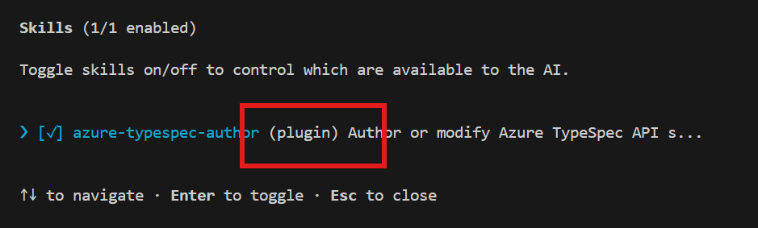

# Azure TypeSpec Authoring 

A skill that helps to author or modify Azure TypeSpec API specifications in the azure-rest-api-specs repository. USE FOR: Any task that creates, modifies, or troubleshoots .tsp files or TypeSpec API specifications — including but not limited to API versioning, ARM or data-plane resource definitions (tracked, proxy, extension, child resources), resource operations (CRUD, PATCH, custom actions, async/LRO), models, enums, unions, properties, decorators, constraints.

## Setup

### Use Published Alpha Version

⚠️ Please note: This version is lack of support for API version evolution and Azure data-plane scenarios. 

Follow the [Quick Start Guide](https://gist.github.com/haolingdong-msft/070ee0bfc3aab9c6ea24b084ec06a734#file-typespec-authoring-agent-quick-start-md).


### Use Latest Dev Version

✅ This version supports basic Azure data-plane and API version evolution scenarios. 

### 1. Install GitHub Copilot CLI

Install the GitHub Copilot CLI by following the [official installation guide](https://docs.github.com/en/copilot/how-tos/copilot-cli).

### 2. Install the Plugin


```shell
copilot plugin install haolingdong-msft/azure-typespec-authoring:plugin
```

> **If using inside the `azure-rest-api-specs` repo:** The project-level alpha version `azure-typespec-author` skill overrides the plugin one. You need to rename the project-level skill file to disable it:
>
> ```shell
> mv .github/skills/azure-typespec-author/SKILL.md .github/skills/azure-typespec-author/SKILL.md.disabled
> ```


### 3. Start an Interactive Session

Navigate to your TypeSpec project path (e.g. `<your path to spec repo>\specification\widget\`) and start a session:

```shell
copilot
```

### 4. Verify Installation

In the current active copilot session.

```
/skills
```

You should see `azure-typespec-author (plugin)` in the list of available skills. 




### 5. Input prompts


## Sample promtps:

Refer [here](https://gist.github.com/haolingdong-msft/070ee0bfc3aab9c6ea24b084ec06a734#sample-prompts).

## Capabilities

The `azure-typespec-author` skill helps you work with TypeSpec API specifications in the `azure-rest-api-specs` repository:

- **API Versioning** — Add new preview or stable API versions, promote preview to stable
- **Resource Definitions** — Define tracked, proxy, extension, and child ARM resources
- **Resource Operations** — CRUD, PATCH, custom actions, async/long-running operations (LRO)
- **Type Definitions** — Models, enums, unions, properties, decorators, and constraints

## Update

```shell
copilot plugin update azure-typespec-authoring@azure-typespec-authoring
```

## Uninstall

```shell
copilot plugin uninstall azure-typespec-authoring@azure-typespec-authoring
```

## Documentation

For more information, visit:

- [TypeSpec Documentation](https://typespec.io/)
- [Azure REST API Specs Repository](https://github.com/Azure/azure-rest-api-specs)
- [GitHub Copilot CLI Plugins](https://docs.github.com/en/copilot/how-tos/copilot-cli/customize-copilot/plugins-creating)

